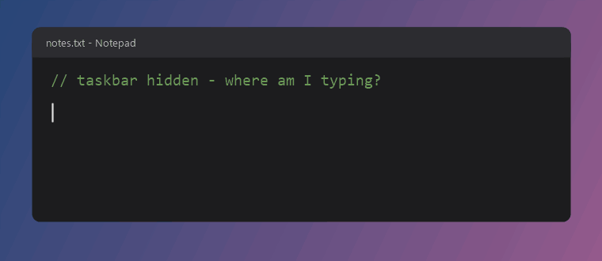
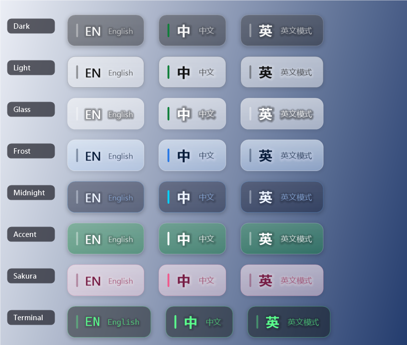

# Language Indicator

A tiny Windows 11 tray app. When you change the input language (Win+Space, Alt+Shift) or press Shift to toggle
Chinese/English inside an IME such as Microsoft Pinyin, a translucent popup fades in next to the text caret (or next to the mouse if there's no caret), then fades out.
It doesn't depend on the taskbar, so it still works with auto-hide on or in full-screen apps.



| State | Popup |
|---|---|
| English layout | **EN** English |
| Chinese IME, Chinese mode | **中** 中文 (accent bar) |
| Chinese IME, English mode (Shift) | **英** 英文模式 |
| Caps Lock on | caption gets `· CAPS` |

## Build
Needs no SDK. It uses the C# compiler that ships with Windows (.NET Framework 4.x):

```
powershell -ExecutionPolicy Bypass -File build.ps1
```

This produces `bin\LanguageIndicator.exe`.

## Use
- Run `bin\LanguageIndicator.exe`. Only one copy runs at a time.
- Tray icon: left-click shows the current state. The right-click menu has:
  - **Theme**: Auto (follows Windows light/dark), Dark, Light, Glass, Frost, Midnight, Accent (your Windows accent color), Sakura, Terminal.
  - **Background opacity**: 15% / 30% / 45% (default) / 60% / 80%. Lower is more see-through. Text gets a soft halo so it stays readable.
  - **Start with Windows**, **Exit**.
- Picking a theme or opacity previews it right away. Settings are saved in `HKCU\Software\LanguageIndicator`.

### Themes
All themes shown at the default 45% background opacity:



## Notes
- Detection combines the foreground thread's keyboard layout with the IME open/conversion mode
  (`WM_IME_CONTROL`). It polls every 120 ms and also checks again right after Shift/Ctrl/Alt/Win/Space/CapsLock is released.
- Windows that run as administrator can't be queried from a normal process. To cover those, run the app elevated.
- If you switch to a window that uses a different language, no popup is shown, so Alt-Tab doesn't trigger one.

## Regenerating the images
`docs/demo.gif` and `docs/themes.png` are drawn by the app's own popup renderer, composited onto a mock editor,
using the same fade and slide timing as the real app. To rebuild them (needs Python with Pillow):

```
powershell -ExecutionPolicy Bypass -File tools\make-demo.ps1
```
